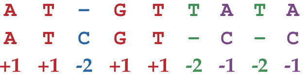

Find a highest-scoring alignment between two strings.

*Input*: A match score m, a mismatch penalty μ, a gap penalty σ, and two DNA strings s and t.

*Output*: The maximum alignment score of s and t followed by an alignment achieving this maximum score.

You are a Bioinformatician and you have obtained two gene sequences, s and t. You want to line up the two sequences to find positions at which they are the same, which could imply some evolutionary relationship. The score of an alignment is defined as the sum of the scores of each position of the alignment, the score of a match is +m, the score of a mismatch is -μ, and the score of a gap is -σ. Below is an example of scoring an alignment between the sequences ATGTTATA and ATCGTCC using a match score of m = 1, a mismatch penalty of μ = 1, and a gap penalty of σ = 2.

*Input Format*. The first line of the input contains m followed by μ followed by σ (separated by spaces), the second line of the input contains a DNA string s, and the third line of the input contains a DNA string t. 

*Output Format*. The first line of the output should contain the maximum score of an alignment between s and t, and the next two lines should contain an alignment achieving this maximum score. Specifically, the second line should contain s with gaps placed appropriately, and the third line should contain t with gaps placed appropriately.

*Constraints*. |s| ≤ 1,000; |t| ≤ 1,000